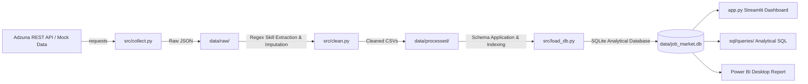

# 📊 Data Analyst Job Market Analysis - End-to-End Intelligence Pipeline

[](https://www.python.org/)
[](https://www.sqlite.org/)
[](https://streamlit.io/)
[](https://powerbi.microsoft.com/)
[](https://github.com/features/actions)
[](https://job-market-analysis-sdqp.onrender.com/)

An end-to-end data engineering, SQL analytics, and interactive dashboard portfolio project that collects, cleans, analyzes, and visualizes live **Data Analyst** job market postings across top tech hubs.

Designed for **recruiters, hiring managers, and data analysts** to instantly explore skill demand trends, compensation benchmarks, hiring hubs, and co-occurrence patterns.

---

## 🌐 Live Demo

👉 **[https://job-market-analysis-sdqp.onrender.com/](https://job-market-analysis-1.onrender.com/)**

> Hosted on Render (free tier) — may take ~30 seconds to wake up if inactive.

---

## ⚡ 1-Click Quick Access (3 Ways to View)

Choose any of the following options to access the project:

### 1️⃣ Option A: Double-Click Launcher (Windows)
Double-click [`launch.bat`](file:///c:/Users/srini/Desktop/sql%20project/job-market-analysis/launch.bat) in the project folder. It will launch the interactive web dashboard directly in your web browser.

### 2️⃣ Option B: Python Command Line Launcher
Run the following command in your terminal:
```bash
python run.py web
```
> Opens the interactive **Streamlit Web Dashboard** at `http://localhost:8501`.

### 3️⃣ Option C: Zero-Dependency Interactive HTML Report (No Python Required)
Open [`outputs/job_market_insights.html`](file:///c:/Users/srini/Desktop/sql%20project/job-market-analysis/outputs/job_market_insights.html) directly in any web browser (Chrome, Edge, Safari, Firefox). It contains interactive Chart.js visualizations, KPI cards, and skill tables!

---

## 🚀 Quick Access CLI Commands (`run.py`)

| Command | Action | Description |
| :--- | :--- | :--- |
| `python run.py web` | **Web Dashboard** | Launches full interactive Streamlit web dashboard |
| `python run.py pipeline` | **Data Pipeline** | Runs complete pipeline (`collect.py` ➔ `clean.py` ➔ `load_db.py`) |
| `python run.py sql` | **SQL Analytics** | Executes all 6 analytical SQL queries with terminal tables |
| `python run.py report` | **HTML Insights** | Generates zero-dependency interactive HTML report |

---

## 🌟 Key Features & Dashboard Modules

The interactive web app ([`app.py`](file:///c:/Users/srini/Desktop/sql%20project/job-market-analysis/app.py)) provides 7 comprehensive modules:

1. 🏆 **Executive Overview**: High-level KPI metric cards (Total Jobs, Top Skills, Benchmark Salary, Remote Work Ratio).
2. 🎯 **Skill Demand Explorer**: Filterable market demand breakdown by skill category (SQL, Python, Power BI, Cloud, ML, ETL).
3. 💰 **Salary Benchmarks**: Compensation distribution across Remote vs. Onsite postings and Seniority Tiers (Entry, Mid, Senior, Lead).
4. 🗺️ **Hiring Hubs & Employers**: Top hiring tech hubs in India (Bengaluru, Mumbai, Delhi NCR, Hyderabad, Pune) and top recruiting companies.
5. 🔍 **Live Job Search Engine**: Search postings by keyword, title, skill, salary range, or remote preference with direct job link redirects.
6. ⚡ **Interactive SQL Playground**: Execute custom ANSI SQL queries directly against `job_market.db` in real-time with instant CSV export.
7. 🔄 **Live Data Pipeline Runner**: Trigger collection, cleaning, and SQLite database refresh with 1 click.

---

## 📊 Business Insights & Key Findings

- **Top Skill Demand**: **SQL (12.8% of total jobs)** is the single most requested technical skill, followed by **Machine Learning (11.9%)** and **Python (8.96%)**.
- **BI Tool Rivalry**: **Power BI (4.07%)** leads **Tableau (2.71%)** in overall posting volume across Indian tech hubs.
- **Skill Co-occurrence**: The most frequent technology pair in single job postings is **Python + SQL (5.12%)**, followed by **Machine Learning + Python (3.01%)** and **Power BI + SQL (2.41%)**.
- **Geographic Concentration**: **Karnataka (Bengaluru)** represents **27.8%** of all job postings, followed by **Maharashtra (13.6%)** and **Telangana (10.2%)**.

---

## 🏗️ Technical Architecture & Pipeline



---

## 𝄗 Database Schema (`data/job_market.db`)

The analytical database implements a 3-table relational star schema with explicit indexing:

- **`jobs`**: Primary table containing cleaned posting metadata, imputed salaries, seniority tiers, work modes, and locations.
- **`skills`**: Master dictionary of 25+ tracked technologies across 6 skill categories.
- **`posting_skills`**: Junction bridge table mapping many-to-many relationships between job postings and required skills.

```sql
-- Core Schema Overview
jobs (job_id [PK], title, company, city, state, remote_status, seniority_level, salary_imputed, ...)
skills (skill_name [PK], category)
posting_skills (job_id [FK], skill_name [FK])
```

---

## 💻 Standalone Analytical SQL Queries

All analytical query scripts are stored in [`sql/queries/`](file:///c:/Users/srini/Desktop/sql%20project/job-market-analysis/sql/queries/):

- [`01_top_skills.sql`](file:///c:/Users/srini/Desktop/sql%20project/job-market-analysis/sql/queries/01_top_skills.sql) - Overall skill demand frequency & market percentage.
- [`02_skills_by_seniority.sql`](file:///c:/Users/srini/Desktop/sql%20project/job-market-analysis/sql/queries/02_skills_by_seniority.sql) - Skill rank changes across Entry, Mid, Senior, and Lead tiers.
- [`03_salary_trends.sql`](file:///c:/Users/srini/Desktop/sql%20project/job-market-analysis/sql/queries/03_salary_trends.sql) - Compensation benchmarks by remote status & seniority.
- [`04_top_hiring_locations_companies.sql`](file:///c:/Users/srini/Desktop/sql%20project/job-market-analysis/sql/queries/04_top_hiring_locations_companies.sql) - City volume & top hiring organizations.
- [`05_skill_cooccurrence.sql`](file:///c:/Users/srini/Desktop/sql%20project/job-market-analysis/sql/queries/05_skill_cooccurrence.sql) - Technology pair frequency co-occurrence matrix.
- [`06_posting_volume_over_time.sql`](file:///c:/Users/srini/Desktop/sql%20project/job-market-analysis/sql/queries/06_posting_volume_over_time.sql) - Posting volume breakdown by search query.

---

## 🛠️ Installation & Manual Setup

### Prerequisites
- Python 3.10+
- Git

### Setup Steps
```bash
# 1. Clone repository
git clone https://github.com/itssrinotshri/job-market-analysis.git
cd job-market-analysis

# 2. Install dependencies
pip install -r requirements.txt

# 3. Launch interactive web dashboard
python run.py web
```

---

## 📁 Repository Sitemap & File Links

```
job-market-analysis/
├── launch.bat                         # Windows 1-Click Double-Click Launcher
├── run.py                             # Cross-Platform CLI Task Runner
├── app.py                             # Interactive Streamlit Web Dashboard
├── README.md                          # Repository Documentation & Quickstart
├── FULL_PROJECT_PORTFOLIO.md          # Comprehensive Single-File Master Document
├── requirements.txt                   # Pinned Python Dependencies
├── .env                               # Local API & Database Settings
├── config.py                          # Global Configuration Loader
├── .github/workflows/daily_pipeline.yml # Automated GitHub Actions Ingestion
├── data/
│   ├── raw/                           # Raw Timestamped JSON API Responses
│   ├── processed/                     # Cleaned CSV Datasets
│   └── job_market.db                  # SQLite Analytical Database
├── src/
│   ├── collect.py                     # API Ingestion Script (with Mock Fallback)
│   ├── clean.py                       # Data Cleaner & Regex Skill Extractor
│   ├── load_db.py                     # Database Schema Application & Loader
│   └── skills_dictionary.py           # Curated Regex Skill Pattern Dictionary
├── sql/
│   ├── schema.sql                     # DDL Database Schema & Indexes
│   └── queries/                       # Analytical SQL Queries (01-06)
└── outputs/
    └── job_market_insights.html       # Standalone Zero-Dependency Interactive HTML Report
```

---

## 👨‍💻 Author & Contact

**Data Analyst Graduate**  
*Portfolio Project for Data Analyst / Business Intelligence Analyst Positions.*  
- **GitHub**: [github.com/itssrinotshri](https://github.com/itssrinotshri)
- **LinkedIn**: [linkedin.com/in/itssrinotshri](https://linkedin.com/in/itssrinotshri)
